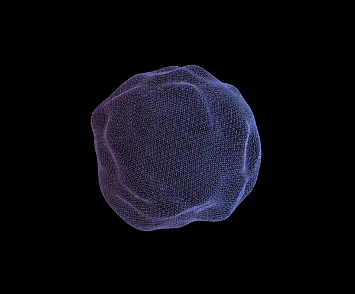
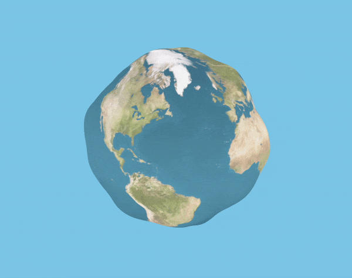
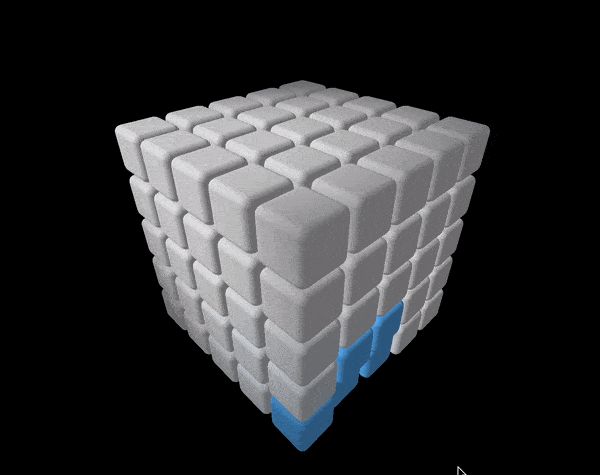
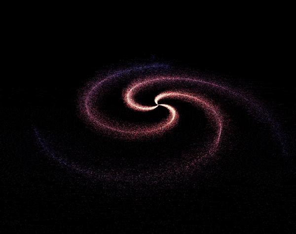
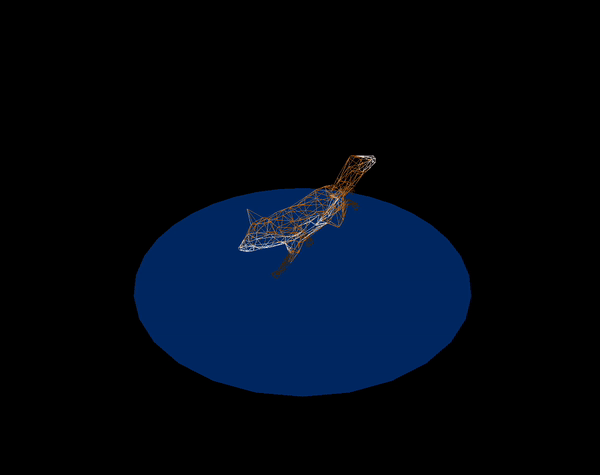
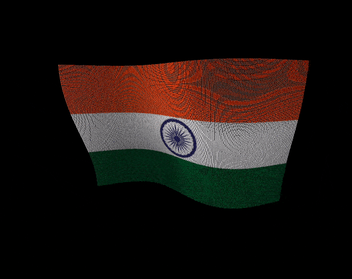
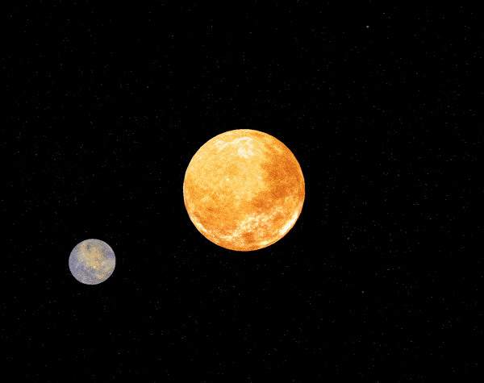
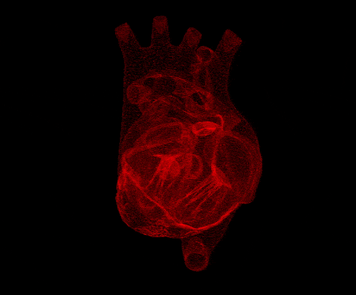
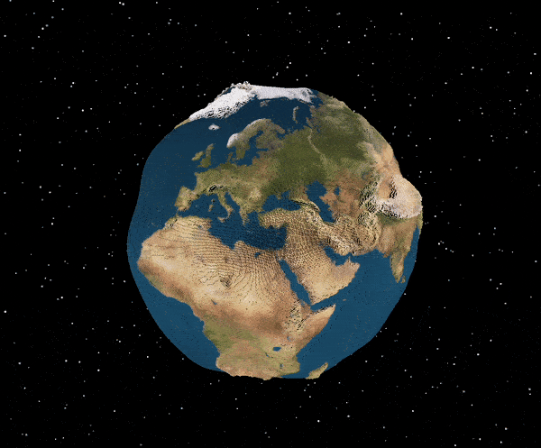

# Bocetos aleatorios con Three.js

## Instalación y ejecución

Para ejecutar cualquiera de los bocetos, asegúrate de tener Node.js instalado en tu sistema.

Luego, clona este repositorio, selecciona la carpeta que prefieras dentro del proyecto, instala las dependencias, inicia el servidor y estarás listo para empezar.

Sigue estos pasos para instalar y ejecutar:

```bash
# Clonar este repositorio
git clone https://github.com/zoyron/random-threejs.git

# Ingresar al proyecto y luego a la carpeta del boceto que desees
cd random-threejs
cd {boceto_de_tu_preferencia}

# Instalar dependencias
npm install

# Iniciar el servidor local
npm run dev
```

Después de completar los pasos anteriores, la animación se abrirá en tu navegador.

___

# Bocetos disponibles en este repositorio

### [Blob](./blob/)


---

### [Tierra blobby](./blobby-earth/)


___


### [Cubos](./cubes/)

___


### [Galaxia](./galaxy/)

___


### [Modelo importado](./imported-models/)

___


### [Shaders](./shaders/)

___


### [Sistema solar](./solarSystem/)

> Este proyecto aún no está completado.


___


### [Muestreador de superficie](./surface-sampler/)

___


### [Tierra con vértices](./vertexEarth/)

