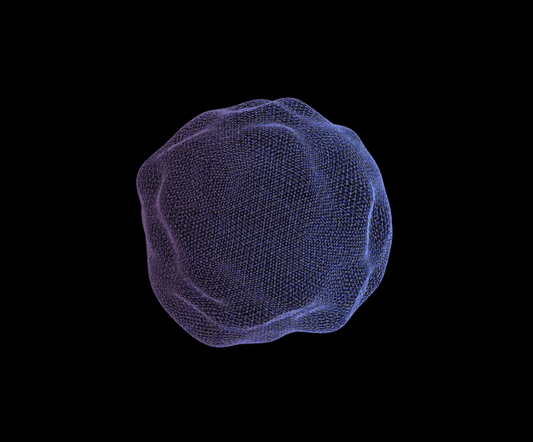

# Random threejs experiments

## Install and run

To the any experiment make sure you have node installed on your system. 

Then clone this repository, get into the directory of your choice inside this repo, install dependencies, fireup the server, and you're good to go.

Follow the bellow steps to install and run:

```bash
# clone this repository
git clone https://github.com/zoyron/random-threejs.git

# cd into the project and then any directory of your choice of experiment
cd random-threejs
cd {experiment_of_your_choice}

# install dependencies
npm install

# runing the local server
npm run dev
```

After following the above steps, the animation would open in your browser window. 

___

# Experiments in this repository

## 1. [Blob](./blob/)

