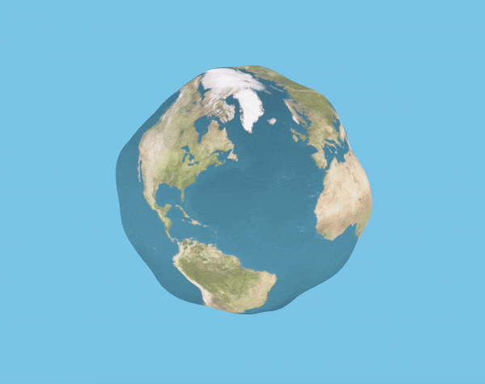
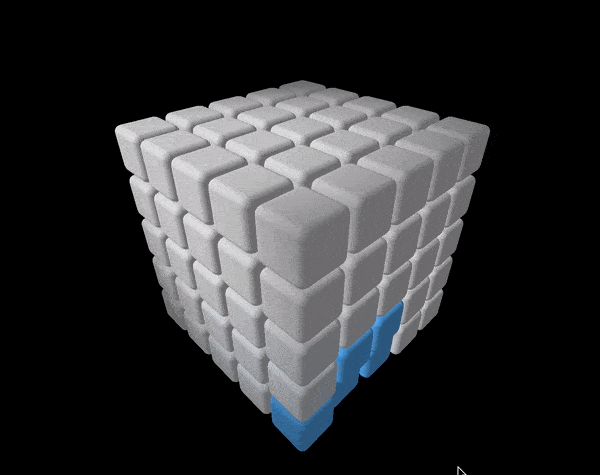
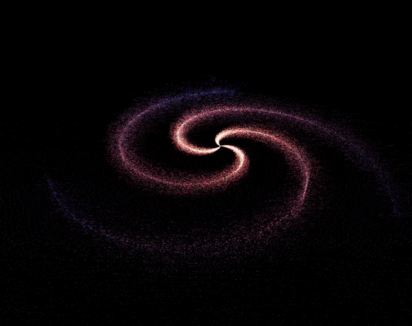
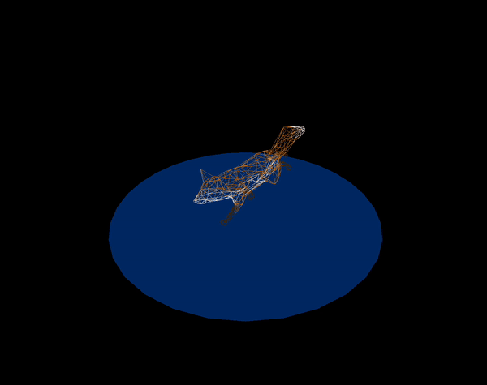
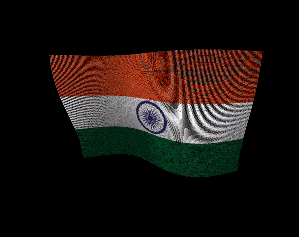
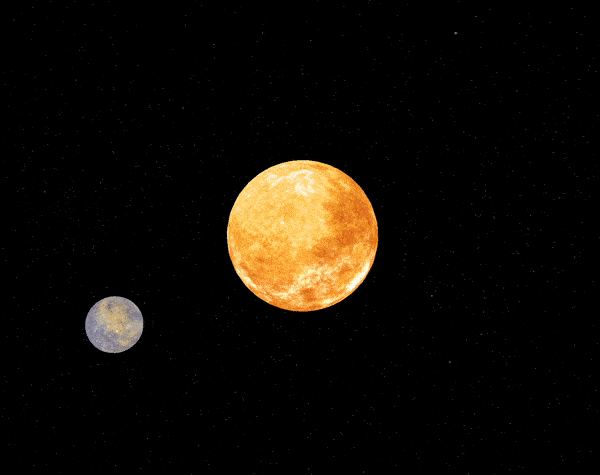
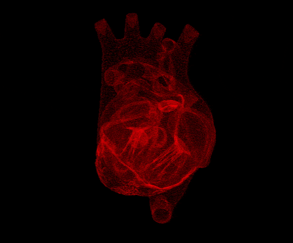
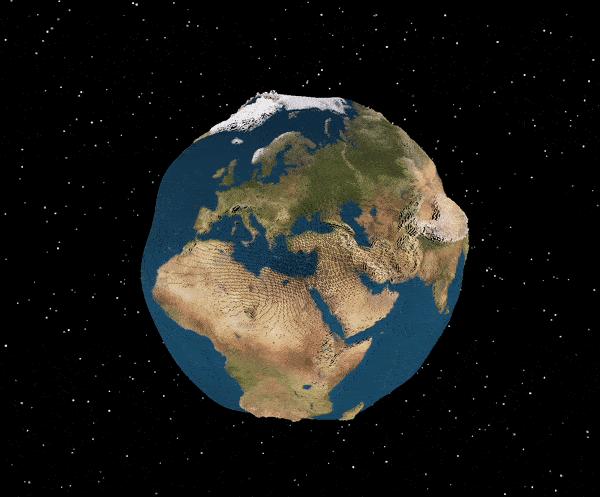

# Random threejs sketches

## Install and run

To the any sketch make sure you have node installed on your system. 

Then clone this repository, get into the directory of your choice inside this repo, install dependencies, fireup the server, and you're good to go.

Follow the bellow steps to install and run:

```bash
# clone this repository
git clone https://github.com/zoyron/random-threejs.git

# cd into the project and then any directory of your choice of sketch
cd random-threejs
cd {sketch_of_your_choice}

# install dependencies
npm install

# runing the local server
npm run dev
```

After following the above steps, the animation would open in your browser window. 

___

# sketches in this repository

### [Blob](./blob/)


---

### [Blobby Earth](./blobby-earth/)


___

### [Cubes](./cubes/)

___

### [Galaxy](./galaxy/)

___

### [Imported Model](./imported-models/)

___

### [Shaders](./shaders/)

___

### [Solar System](./solarSystem/)

> This is not complete yet


___

### [Surface Sampler](./surface-sampler/)

___

### [Vertex Earth](./vertexEarth/)

